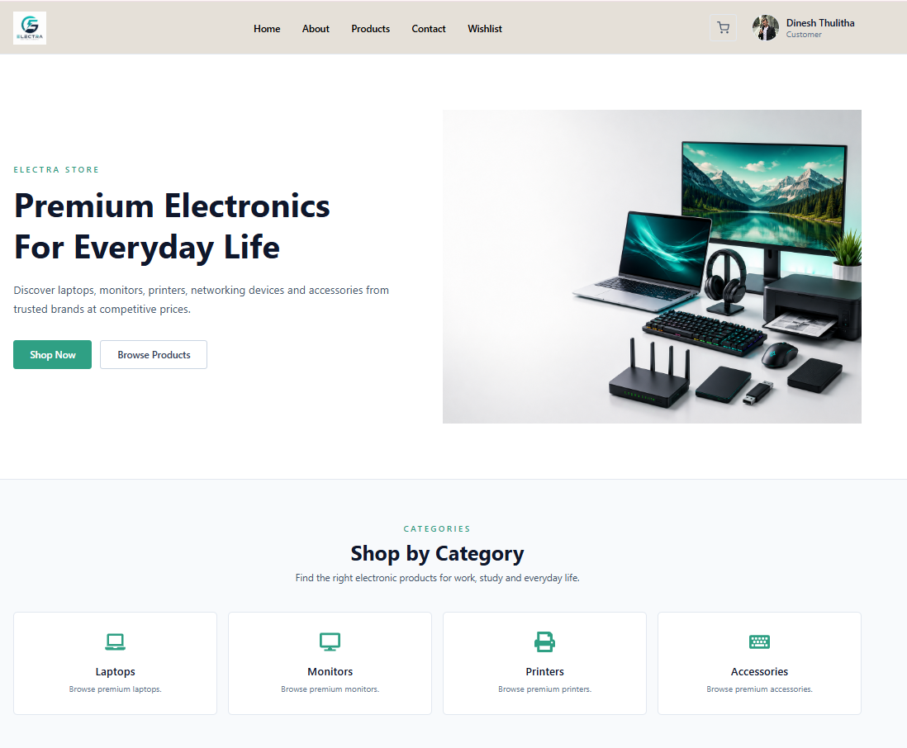
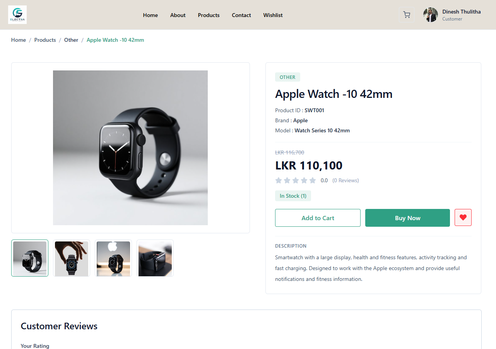
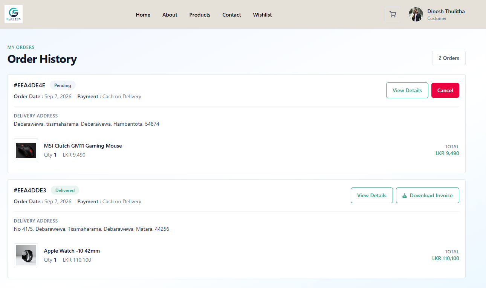
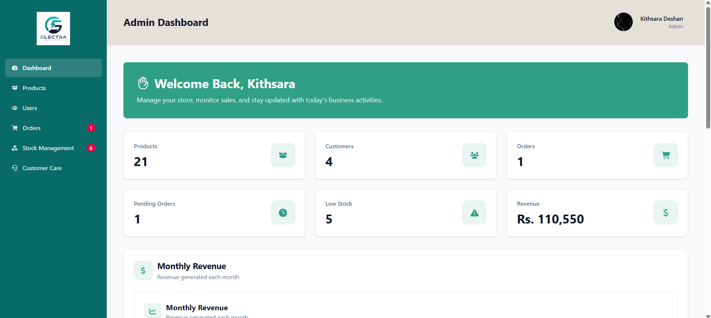
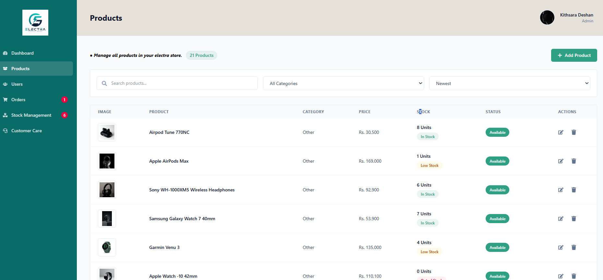
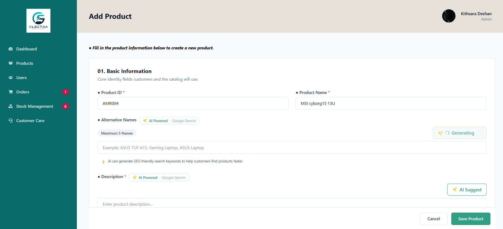
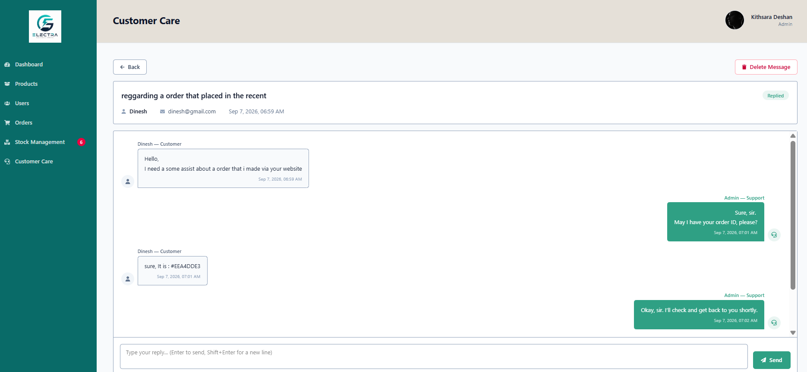
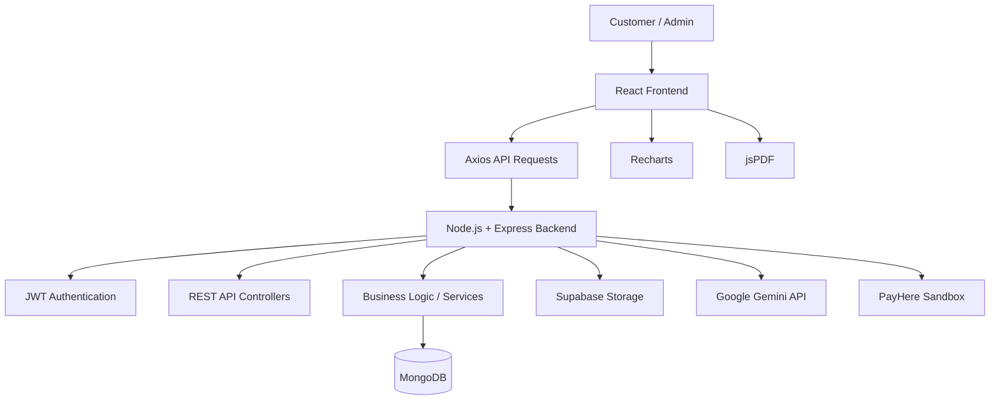
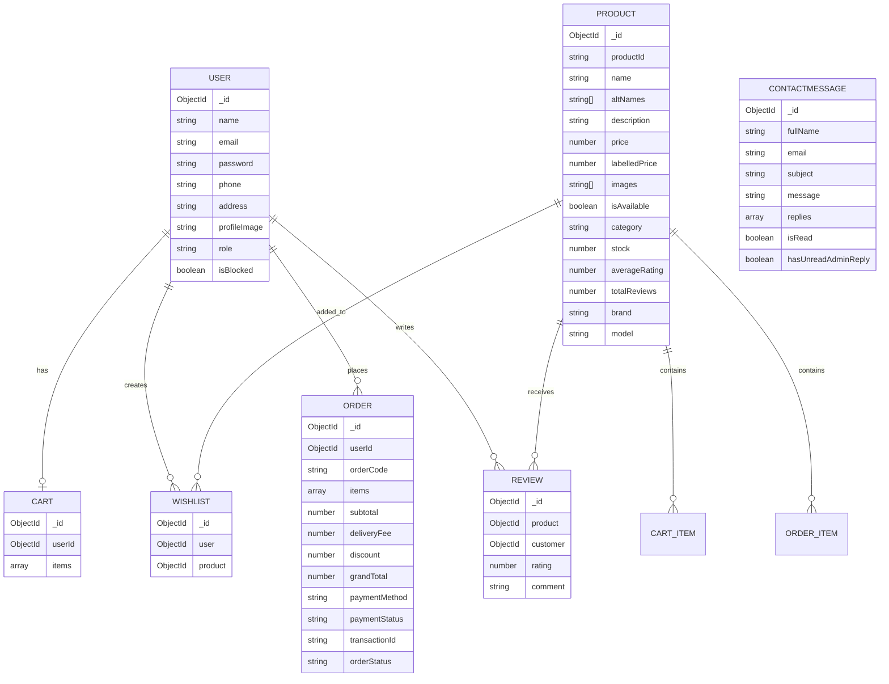

Electra is a full-stack MERN e-commerce web application developed for managing and selling electronic products online. The system provides a complete customer shopping experience together with an administration dashboard for managing products, users, orders, stock, customer messages, and revenue analytics.


## 🔗 Project Repositories


### Frontend
[Electra Frontend Repository](https://github.com/Kithsara-01/electra-ecommerce-mern-frontend)

### Backend
[Electra Backend Repository](https://github.com/Kithsara-01/electra-ecommerce-mern-backend)


## 🌐 Live Demo

Electra is deployed as a full-stack web application with a separately hosted frontend and backend.

### Frontend Deployment

The React frontend is deployed on Vercel and provides the customer-facing e-commerce interface and administration dashboard.

**Platform:** Vercel  
**Environment:** Production  
**Live Application:**  
[Visit Electra Live Website](https://electra-ecommerce-mern-frontend.vercel.app/)

### Backend Deployment

The Node.js and Express.js backend is deployed on Render and provides the REST APIs, authentication, business logic, and database communication.

**Platform:** Render  
**Environment:** Production  
**Backend API:**  
[Electra Backend API](https://electra-ecommerce-mern-backend.onrender.com)


## 🖥️ UI Showcase

The following UI screens demonstrate the main customer and admin interfaces of the Electra e-commerce system.

### Customer Interface

| Home Page | Product Details |
|---|---|
|  |  |

| Customer Product Page | Order History |
|---|---|
|  |  |

### Admin Interface

| Admin Dashboard | Product Management |
|---|---|
|  |  |

| AI Product Assistance | Customer Care |
|---|---|
|  |  |


## 🏗️ System Architecture

Electra follows a separated frontend and backend architecture where the React frontend communicates with the Node.js/Express backend through REST APIs.




## 🚀 Project Overview

The application is built using the MERN stack and follows a separated frontend/backend architecture.

### Main Technologies

- **Frontend:** React, Vite, Tailwind CSS
- **Backend:** Node.js, Express.js
- **Database:** MongoDB with Mongoose
- **Authentication:** JWT with HTTP-only cookies
- **API Communication:** Axios
- **Cloud Storage:** Supabase Storage
- **AI Features:** Google Gemini API
- **Charts:** Recharts
- **UI Notifications:** React Hot Toast, SweetAlert2
- **Payment Gateway:** PayHere Sandbox
- **PDF Generation:** jsPDF

## 🗄️ Database Design

Electra uses MongoDB with Mongoose for database management. The main collections are designed to support users, products, shopping activities, orders, reviews, and customer support.



### Main Collections

- **User** – Stores customer and admin account information.
- **Product** – Stores electronic product details, pricing, images, availability, stock, and ratings.
- **Cart** – Stores products and quantities associated with a customer.
- **Wishlist** – Stores products saved by customers.
- **Order** – Stores customer orders, delivery information, order items, payment details, and order status.
- **Review** – Stores customer ratings and reviews for products.
- **ContactMessage** – Stores customer care messages and admin replies.

## ✨ Main Features

### 👤 Customer Features

- Customer registration and login
- Secure authentication and protected routes
- Customer profile management
- Password change
- Browse electronic products
- Product search
- Product details
- Shopping cart management
- Wishlist management
- Checkout and delivery information
- Cash on Delivery
- PayHere online payment
- Order history
- Order details and delivery status tracking
- Order cancellation
- Product reviews and ratings
- Contact/customer care messaging
- View admin replies
- Invoice generation

### 🛠️ Admin Features

- Admin dashboard
- Product management
  - Add products
  - Edit products
  - Delete products
  - Search products
  - Manage product availability
  - Update stock
  - Upload product images
- User management
  - View users
  - View user details
  - Block/unblock users
- Order management
  - View all orders
  - View order details
  - Update order status
- Stock management
- Revenue analytics
- Daily/monthly revenue analysis
- Revenue by product
- Customer care management
- Customer message notifications
- Admin profile management
- AI-assisted product description generation
- AI-assisted alternative product name generation

## 💳 Payment Integration

Electra includes **PayHere Sandbox** integration for testing online payments.

The payment flow is:

1. Customer selects PayHere at checkout.
2. The frontend sends payment information to the backend.
3. The backend generates the PayHere payment hash.
4. Customer is redirected to the PayHere Sandbox payment page.
5. A successful sandbox payment returns the customer to the application.
6. The order is completed and stored with the payment information.

> **Note:** PayHere is currently configured for Sandbox/testing purposes. No real financial transactions are processed through the sandbox environment.

## 🔐 Authentication & Authorization

The application uses JWT-based authentication with HTTP-only cookies.

Protected functionality is controlled using role-based authorization.

### Roles

- **Customer**
- **Admin**

Examples:

- Customers can manage their cart, wishlist, orders, profile, and reviews.
- Admins can manage products, users, orders, stock, revenue, and customer messages.

## 🧠 AI Integration

The backend integrates the Google Gemini API to assist administrators with product content.

AI functionality includes:

- Product description generation
- Alternative product name generation

This helps reduce the time required to manually create product information.

## 🗂️ Project Structure

```text
electra/
│
├── backend/
│   ├── controllers/
│   ├── database/
│   ├── middlewares/
│   ├── models/
│   ├── routers/
│   ├── services/
│   ├── utils/
│   ├── index.js
│   └── package.json
│
└── frontend/
    ├── src/
    │   ├── assets/
    │   ├── components/
    │   ├── context/
    │   ├── pages/
    │   ├── routes/
    │   ├── services/
    │   ├── utils/
    │   ├── App.jsx
    │   └── main.jsx
    ├── public/
    └── package.json
```

## 🔌 Backend API Modules

The backend is organized into separate API modules for maintainability.

- Authentication
- Users
- Products
- Cart
- Wishlist
- Orders
- Reviews
- Contact/Customer Care
- Dashboard & Revenue Analytics

## 🔌 API Documentation

Electra provides RESTful APIs for authentication, users, products, cart, wishlist, orders, reviews, customer care, dashboard analytics, and payments.

### Authentication APIs

| Method | Endpoint | Access |
|---|---|---|
| POST | `/api/auth/register/customer` | Public |
| POST | `/api/auth/login` | Public |
| POST | `/api/auth/logout` | Authenticated |

### User APIs

| Method | Endpoint | Access |
|---|---|---|
| GET | `/api/users/profile` | Authenticated |
| PUT | `/api/users/profile` | Authenticated |
| PUT | `/api/users/change-password` | Authenticated |
| GET | `/api/users` | Admin |
| GET | `/api/users/:id` | Admin |
| PUT | `/api/users/:id/block` | Admin |
| PUT | `/api/users/:id/unblock` | Admin |

### Product APIs

| Method | Endpoint | Access |
|---|---|---|
| GET | `/api/products` | Public |
| GET | `/api/products/search/:query` | Public |
| GET | `/api/products/:productId` | Public |
| GET | `/api/products/admin` | Admin |
| POST | `/api/products` | Admin |
| POST | `/api/products/ai-description` | Admin |
| POST | `/api/products/ai-alternative-names` | Admin |
| PUT | `/api/products/:productId` | Admin |
| PATCH | `/api/products/:productId/stock` | Admin |
| DELETE | `/api/products/:productId` | Admin |

### Cart APIs

| Method | Endpoint | Access |
|---|---|---|
| POST | `/api/cart/add` | Authenticated |
| GET | `/api/cart` | Authenticated |
| PUT | `/api/cart/update` | Authenticated |
| DELETE | `/api/cart/remove` | Authenticated |
| DELETE | `/api/cart/clear` | Authenticated |

### Wishlist APIs

| Method | Endpoint | Access |
|---|---|---|
| GET | `/api/wishlist` | Authenticated |
| GET | `/api/wishlist/check/:productId` | Authenticated |
| POST | `/api/wishlist/:productId` | Authenticated |
| DELETE | `/api/wishlist/:productId` | Authenticated |

### Order APIs

| Method | Endpoint | Access |
|---|---|---|
| POST | `/api/orders` | Authenticated |
| GET | `/api/orders/my-orders` | Authenticated |
| GET | `/api/orders/:orderId` | Authenticated |
| PUT | `/api/orders/:orderId/cancel` | Authenticated |
| GET | `/api/orders` | Admin |
| PUT | `/api/orders/:orderId` | Admin |

### Review APIs

| Method | Endpoint | Access |
|---|---|---|
| GET | `/api/reviews/product/:productId` | Public |
| POST | `/api/reviews` | Authenticated |
| PUT | `/api/reviews/:id` | Authenticated |
| DELETE | `/api/reviews/:id` | Authenticated |

### Customer Care APIs

| Method | Endpoint | Access |
|---|---|---|
| POST | `/api/contact` | Public |
| GET | `/api/contact/my-messages` | Customer |
| GET | `/api/contact/my-messages/:id` | Customer |
| GET | `/api/contact/unread-replies-count` | Customer |
| GET | `/api/contact/unread-count` | Admin |
| GET | `/api/contact` | Admin |
| GET | `/api/contact/:id` | Admin |
| PUT | `/api/contact/:id/read` | Admin |
| PUT | `/api/contact/:id/reply` | Authenticated |
| DELETE | `/api/contact/:id` | Admin |

### Dashboard & Analytics APIs

| Method | Endpoint | Access |
|---|---|---|
| GET | `/api/dashboard/stats` | Admin |
| GET | `/api/dashboard/revenue` | Admin |
| GET | `/api/dashboard/notifications` | Admin |

### Payment APIs

| Method | Endpoint | Access |
|---|---|---|
| POST | `/api/payments/init` | Public |

## ⚙️ Installation & Setup

### 1. Clone the project

```bash
git clone <your-repository-url>
cd electra
```

### 2. Backend Setup

```bash
cd backend
npm install
npm start
```

Create a `.env` file inside the backend folder:

```env
PORT=3000
MONGO_URI=your_mongodb_connection_string
CLIENT_URL=http://localhost:5173
JWT_SECRET=your_jwt_secret

SUPABASE_URL=your_supabase_url
SUPABASE_SERVICE_KEY=your_supabase_service_key

GEMINI_API_KEY=your_gemini_api_key

PAYHERE_MERCHANT_ID=your_payhere_merchant_id
PAYHERE_MERCHANT_SECRET=your_payhere_merchant_secret
PAYHERE_RETURN_URL=your_return_url
PAYHERE_CANCEL_URL=your_cancel_url
PAYHERE_NOTIFY_URL=your_notify_url
```

### 3. Frontend Setup

Open another terminal:

```bash
cd frontend
npm install
npm run dev
```

Create a `.env` file inside the frontend folder:

```env
VITE_API_URL=http://localhost:3000/api
VITE_SUPABASE_URL=your_supabase_url
VITE_SUPABASE_ANON_KEY=your_supabase_anon_key
```

## 🌐 Application Flow

```text
Customer
   │
   ├── Register / Login
   │
   ├── Browse Products
   │
   ├── Add to Cart / Wishlist
   │
   ├── Checkout
   │      │
   │      ├── Cash on Delivery
   │      │
   │      └── PayHere Sandbox
   │
   ├── Place Order
   │
   ├── Track Order
   │
   └── Review Product


Admin
   │
   ├── Dashboard
   ├── Products
   ├── Users
   ├── Orders
   ├── Stock Management
   ├── Revenue Analytics
   └── Customer Care
```

## 📊 Admin Dashboard

The admin dashboard provides an overview of the store, including:

- Total revenue
- Today's revenue
- Total orders
- Revenue trends
- Product-level revenue
- Stock information
- Order notifications
- Customer care notifications

## 🛡️ Security

The application includes several security-related practices:

- Password hashing
- JWT authentication
- HTTP-only authentication cookies
- Protected API routes
- Role-based authorization
- CORS configuration
- Environment variables for sensitive credentials
- Input validation on important checkout fields

## 🧪 Testing

For payment testing, the PayHere Sandbox environment can be used with PayHere's official sandbox test cards.

No real card or financial information should be used with the sandbox environment.

## 📌 Current Project Status

The project has reached a functional and presentable stage with the core e-commerce workflow implemented:

- Customer authentication
- Product browsing
- Cart and wishlist
- Checkout
- Cash on Delivery
- PayHere Sandbox payment flow
- Order management
- Admin dashboard
- Stock management
- Revenue analytics
- Customer care
- Reviews and ratings
- AI-assisted product content

The project can be further extended with additional production-level features such as advanced reporting, automated email notifications, delivery integration, and additional payment methods.

## 👨‍💻 Purpose

This project was developed as a practical full-stack development project to gain hands-on experience with:

- MERN stack development
- REST API development
- MongoDB database design
- Authentication and authorization
- React component architecture
- State management and protected routes
- Payment gateway integration
- Cloud storage
- AI API integration
- Admin dashboard development
- Git and GitHub based collaboration
- Deployment and environment configuration

## 📄 License

This project is developed for educational and portfolio purposes.
